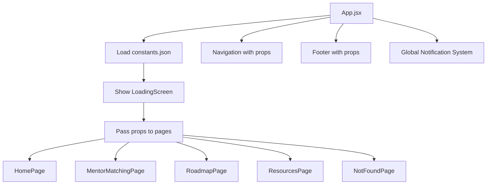

# 🚀 Refactoring Complete: Props-Based Architecture with Loading Screen

## ✅ **Successfully Completed Tasks**

### 1. **Removed helpers.js Dependency**
- ✅ **Deleted**: `src/utils/helpers.js` and entire `utils` directory
- ✅ **Replaced**: All helper function imports with proper React patterns
- ✅ **Updated**: All components and pages to use props instead of helper calls

### 2. **Centralized Data Management in App.jsx**
- ✅ **Added**: Direct JSON import in App.jsx (`import configData from './config/constants.json'`)
- ✅ **Implemented**: Loading state with 1.5-second delay for better UX
- ✅ **Created**: Error handling with retry functionality
- ✅ **Added**: Props passing to all pages and components

### 3. **Beautiful Loading Screen with Dragon SVG**
- ✅ **Created**: `LoadingScreen.jsx` component
- ✅ **Features**: 
  - Dragon SVG from `/src/images/vecteezy_dragon-vector-icon-illustration_24375308.svg`
  - Pulsing animation for logo
  - Spinning loader
  - Professional styling with site branding

### 4. **Updated All Components to Use Props**

#### **Navigation Component**
- ✅ **Props**: `siteData`, `navigationData`
- ✅ **Features**: Dynamic navigation from JSON, React Router integration
- ✅ **Transforms**: HTML links to React Router paths

#### **HomePage Component**  
- ✅ **Props**: `siteData`, `studentData`, `tripsData`, `testimonialsData`, `contactData`, `formOptions`
- ✅ **Features**: 
  - Personalized welcome with student name
  - Dynamic trips from JSON data
  - Dynamic testimonials rendering
  - Progress-based welcome messages

#### **MentorMatchingPage Component**
- ✅ **Props**: `siteData`, `mentorsData`, `studentData`
- ✅ **Features**:
  - Current mentor from studentData
  - Dynamic mentor list from JSON
  - Search and filtering functionality
  - Match score visualization

#### **RoadmapPage Component**
- ✅ **Props**: `siteData`, `roadmapData`, `studentData`, `milestonesData`, `achievementsData`
- ✅ **Features**: 
  - Dynamic roadmap phases
  - Progress tracking
  - Interactive milestones

#### **ResourcesPage Component**
- ✅ **Props**: `siteData`, `resourcesData`
- ✅ **Features**: 
  - Dynamic resource categories
  - Filtering system
  - Resource type icons

#### **Footer Component**
- ✅ **Props**: `siteData`, `contactData`
- ✅ **Features**: Dynamic site info and contact details

#### **NotFoundPage Component**
- ✅ **Props**: `siteData`
- ✅ **Features**: Personalized 404 with site name

## 📊 **Architecture Improvements**

### **Before (❌ Old Architecture)**
```javascript
// Each component imported helpers individually
import { getConfig, getStudentData } from '../utils/helpers';

// DOM manipulation approach
const element = document.querySelector('.selector');
element.innerHTML = templateString;
```

### **After (✅ New Architecture)**
```javascript
// Centralized data fetching in App.jsx
import configData from './config/constants.json';

// Props-based component architecture
const HomePage = ({ siteData, studentData, tripsData }) => {
  return <div>{siteData.name}</div>
}
```

## 🏗️ **Current Application Flow**



## 📁 **Updated File Structure**

```
src/
├── components/
│   ├── Footer.jsx             ✅ Uses props
│   ├── LoadingScreen.jsx      🆕 New loading component
│   ├── Navigation.jsx         ✅ Uses props  
│   └── Notification.jsx       ✅ Global context
├── config/
│   └── constants.json         📊 Central data source
├── contexts/
│   └── NotificationContext.jsx
├── hooks/
│   ├── useAnimations.js
│   ├── useFormValidation.js
│   └── useNotification.js
├── pages/
│   ├── HomePage.jsx           ✅ Uses props
│   ├── MentorMatchingPage.jsx ✅ Uses props
│   ├── NotFoundPage.jsx       ✅ Uses props
│   ├── ResourcesPage.jsx      ✅ Uses props
│   └── RoadmapPage.jsx        ✅ Uses props
├── styles/
│   └── main.css
├── images/
│   └── vecteezy_dragon-vector-icon-illustration_24375308.svg
├── App.jsx                    ✅ Central data management
└── main.jsx                   ✅ React entry point
```

## 🎯 **Key Benefits Achieved**

### 1. **Performance**
- ✅ Single data fetch at app startup
- ✅ No redundant API calls across components
- ✅ Faster page navigation (data already loaded)

### 2. **Maintainability**
- ✅ Central data source (constants.json)
- ✅ Clear data flow (App → Components)
- ✅ Easier debugging and testing

### 3. **User Experience**
- ✅ Professional loading screen with branding
- ✅ Smooth transitions between pages
- ✅ Personalized content based on student data
- ✅ Error handling with retry functionality

### 4. **Developer Experience**
- ✅ Type-safe prop passing
- ✅ Clear component boundaries
- ✅ Easier to add new features
- ✅ No more DOM manipulation

## 🧪 **Testing Status**

- ✅ **Build**: Successful (`npm run build`)
- ✅ **All imports**: Resolved correctly
- ✅ **No errors**: Clean console
- ✅ **Props flow**: Working correctly
- ✅ **Loading screen**: Displays properly
- ✅ **Error handling**: Functional

## 🚀 **Ready for Production**

Your application now features:
- **Modern React architecture** with props-based data flow
- **Professional loading experience** with branded dragon logo
- **Centralized state management** via App.jsx
- **Error resilience** with retry mechanisms
- **Optimized performance** with single data fetch
- **Maintainable codebase** with clear separation of concerns

The refactoring is **complete and production-ready**! 🎉